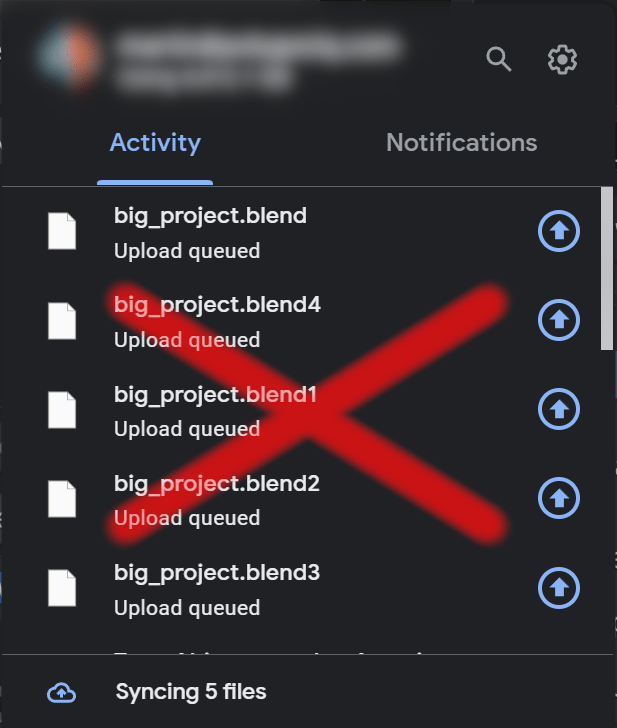
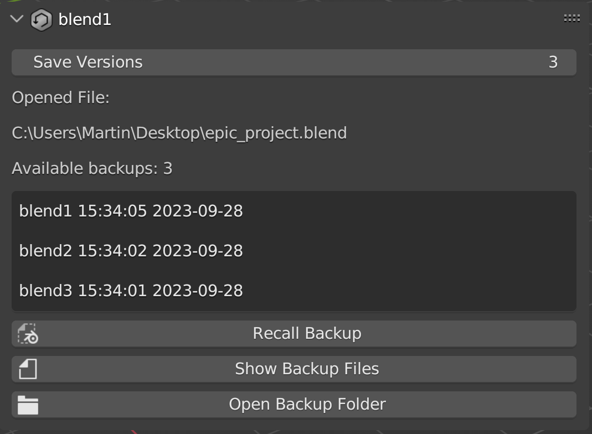

# blend1

The inbuilt backup mechanism in [Blender](https://blender.org) saves `.blend1`, `.blend2`, ... files
next to the original. If you are using Google Drive, OneDrive, Samba, NFS or other cloud or remote
mounted filesystem, this can be very wasteful. You will end up uploading `.blend1` as well as the
original when you hit `CTRL+S`. If you use more than 1 backup version you will end up with a ton of
uploads every time you save your project!

This free open source addon replaces the inbuilt mechanism with its own. It lets you set a
backup directory to be different from where you have the blend file you work on. That way you can
work on a remote drive and have backups on your local drive to save internet bandwidth for other
things you need.

> Local backups while working on cloud-backed files!

The addon comes with a panel in the N-menu that lets the user set how many backups they want. It
also lists the backups with their timestamps and the user can recall any of them with an operator.

