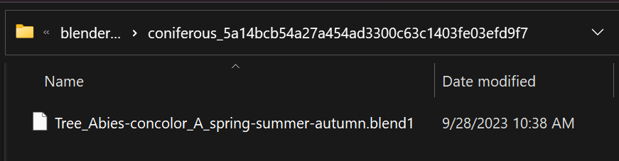

  

  <h3 align="center">blend1</h3>

  Save Blender backup files to a different location than opened blend, with an easily accessible recall. Enhances cloud storage experience.
   
   
  <a href="#about"><strong>Check out the screenshots »</strong></a>
   
  <a href="https://github.com/polygoniq/blend1/issues/new?assignees=&labels=bug&template=01_BUG_REPORT.md&title=bug%3A+">Report a Bug</a>
  ·
  <a href="https://github.com/polygoniq/blend1/issues/new?assignees=&labels=enhancement&template=02_FEATURE_REQUEST.md&title=feat%3A+">Request a Feature</a>
  ·
  <a href="https://github.com/polygoniq/blend1/issues/new?assignees=&labels=question&template=04_SUPPORT_QUESTION.md&title=support%3A+">Ask a Question</a>
   

  
  
  
  
  

Table of Contents

- [About](#about)
- [Getting Started](#getting-started)
  - [Prerequisites](#prerequisites)
  - [Installation](#installation)
    - [Blender 4.2 or newer](#blender-42-or-newer)
    - [Blender 4.1 or older](#blender-41-or-older)
      - [Download the ZIP](#download-the-zip)
      - [Install ZIP in Blender](#install-zip-in-blender)
    - [Updating](#updating)
- [Usage](#usage)
- [Roadmap](#roadmap)
- [Support](#support)
- [Project assistance](#project-assistance)
- [Contributing](#contributing)
- [License](#license)

---

## About

> 
>
> The inbuilt backup mechanism in [Blender](https://blender.org) saves `.blend1`, `.blend2`, ...
> files next to the original. If you are using Google Drive, OneDrive, Samba, NFS or other cloud
> or remote mounted filesystem, this can be very wasteful. You will end up uploading `.blend1` as
> well as the original when you hit `CTRL+S`. If you use more than 1 backup version you will end
> up with a ton of uploads every time you save your project!
>
> At [polygoniq](https://polygoniq.com) we use [Google Drive](https://www.google.com/drive/) for
> all our customer projects. And even though we have a very fast internet connection we ended up
> saturating it with all the backup uploads. That's why we decided to create this addon.
> We have only the main .blend stored on Google Drive while we save backups locally.
> That way backups are available in case something goes wrong and at the same time uploads
> are fast and collaborating on large blends over Google Drive is possible.

Screenshots

 

|                             Addon Panel                                      |                            Recall Backup                                     |
| :--------------------------------------------------------------------------: | :--------------------------------------------------------------------------: |
|      |  |

|                           Backup Folder                                      |                         Inside a Backup Folder                               |
| :--------------------------------------------------------------------------: | :--------------------------------------------------------------------------: |
|  |  |

## Getting Started

### Prerequisites

> You need [Blender 3.3 LTS or higher](https://blender.org). Windows, macOS 10 and Linux are
> supported.

### Installation

#### Blender 4.2 or newer
Visit [polygoniq extensions repository](https://extensions.polygoniq.com), where we explain
how to set it up as remote repository so you can install and update everything from Blender.

#### Blender 4.1 or older
##### Download the ZIP
|                          Stable Release                                                  |                         Unstable Master Branch                   |
| :--------------------------------------------------------------------------------------: | :--------------------------------------------------------------: |
| Head over to [Releases](https://github.com/polygoniq/blend1/releases) for a stable ZIP.  | Click `Code` -> `Download ZIP` if you are feeling adventurous.   |

##### Install ZIP in Blender

Go to `Edit` -> `Preferences`. And select `Add-ons` in the left bar. Click the `Install...` button
in the top section. Select the ZIP file you just downloaded and click `Install Add-on`. After the
installation finishes, check the checkbox next to the `blend1` addon.

#### Updating

The addon can auto-update itself to latest stable or even unstable master version. Head over to
`Edit` -> `Preferences` and select `Add-ons` in the left bar. Type `blend1` into the search bar
and then expand the addon section of `blend1`. Scroll down to the auto update section to set up
update intervals or even update manually.

## Usage

> Set up the `Save versions` to the desired number of backups of your work. Work in Blender as
> usual. If you need to recall a backup, open the `N` menu and look for the `blend1` panel. Use
> the `Recall` operator to recall a backup.

## Roadmap

See the [open issues](https://github.com/polygoniq/blend1/issues) for a list of proposed features (and known issues).

- [Top Feature Requests](https://github.com/polygoniq/blend1/issues?q=label%3Aenhancement+is%3Aopen+sort%3Areactions-%2B1-desc) (Add your votes using the 👍 reaction)
- [Top Bugs](https://github.com/polygoniq/blend1/issues?q=is%3Aissue+is%3Aopen+label%3Abug+sort%3Areactions-%2B1-desc) (Add your votes using the 👍 reaction)
- [Newest Bugs](https://github.com/polygoniq/blend1/issues?q=is%3Aopen+is%3Aissue+label%3Abug)

## Support

Reach out to the maintainers at one of the following places:

- Joining our [Discord community](https://polygoniq.com/discord/) for the fastest support.
- [GitHub issues](https://github.com/polygoniq/blend1/issues/new?assignees=&labels=question&template=04_SUPPORT_QUESTION.md&title=support%3A+)
- Contact options listed on [this GitHub profile](https://github.com/polygoniq)

## Project assistance

If you want to say **thank you** or/and support active development of blend1:

- Add a [GitHub Star](https://github.com/polygoniq/blend1) to the project.
- Tweet about blend1.

Together, we can make blend1 **better**!

## Contributing

First of, thanks for taking the time to contribute! Contributions are what make the open-source
community such an amazing place to learn, inspire, and create. Any contributions you make will
benefit everybody else and are **greatly appreciated**.

Please read [our contribution guidelines](docs/CONTRIBUTING.md), and thank you for being involved!

## License

This project is licensed under the **GNU General Public License v3**.

See [LICENSE](LICENSE) for more information.